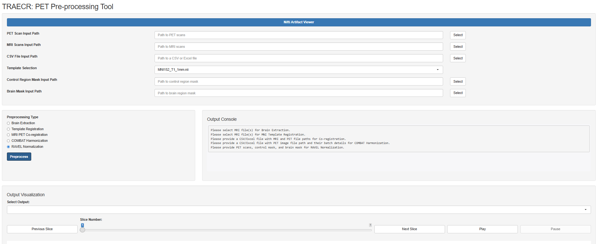
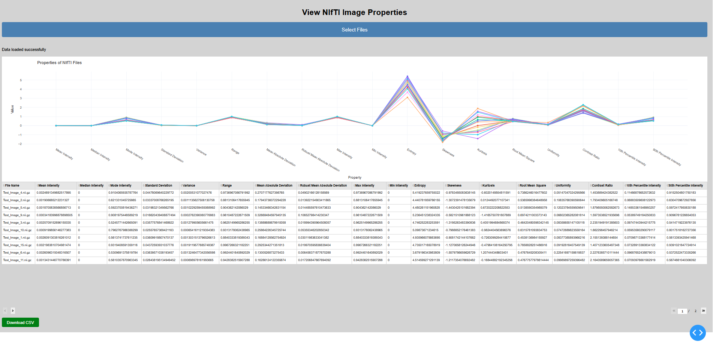
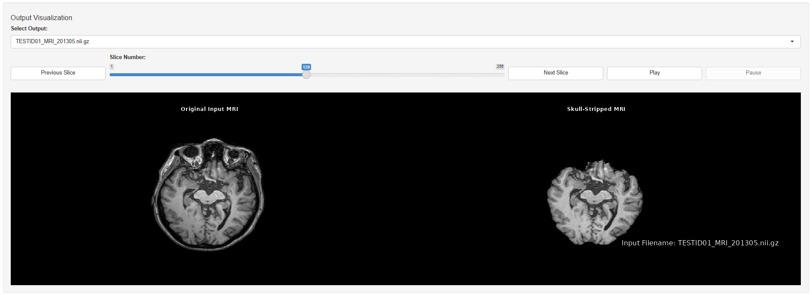
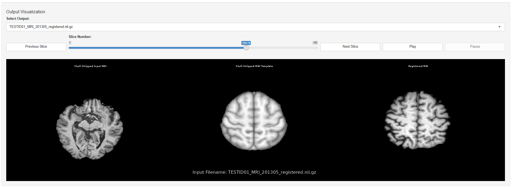
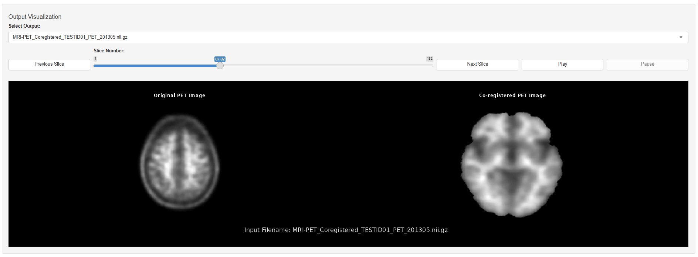
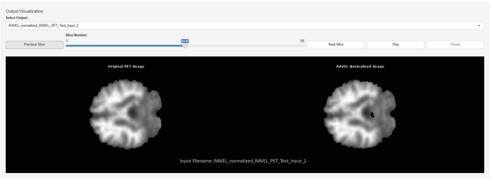

# PET Pre-processing Tool

A Shiny R application for automated preprocessing of neuroimaging data. This tool supports PET and MRI scans, streamlining brain extraction, MNI template registration, MRI-PET co-registration, COMBAT harmonization, and RAVEL normalization.

## Features

- **A Shiny R Application**: A neuroimaging preprocessing tool with interactive visualization, artifact inspection, and error-handling for clear user guidance.
  
  
- **Artifact Viewer**: Launch an external NIfTI artifact viewer for detailed examination of imaging data to include/exclude pre-processing of unwanted neuroimaging data.
  
- **Interactive Visualization**: Inspect preprocessing results with slice-by-slice navigation and real-time updates.
- **Brain Extraction**: Automated skull-stripping of MRI scans to isolate brain tissue.
  
- **MNI Template Registration**: Align MRI scans to the MNI standard space for consistent spatial analysis.
  
- **MRI-PET Co-registration**: Aligns PET scans with corresponding MRI scans for integrated analysis.
  
- **COMBAT Harmonization**: Reduces scanner and site effects in neuroimaging data using the Combating Batch Effects (COMBAT) algorithm.
  
- **RAVEL Normalization**: Normalizes PET scan intensities to reduce unwanted variations using the Removing inter-subject technical variability in magnetic resonance imaging studies (RAVEL) algorithm.
  


- ## Folder Structure

- `templates/`: Contains MNI template files for registration.
- `Dashboard/`: Contains a python code to display and export NIfTI image properties.
- `Output_Brain_Extraction/`: Outputs from the brain extraction step.
- `Output_MNI_Template_Registration/`: Outputs from the MNI registration step.
- `Output_MRI_PET_Co-Registration/`: Outputs from the MRI-PET co-registration step.
- `Output_COMBAT_Harmonization/`: Outputs from COMBAT harmonization.
- `Output_RAVEL_Normalization/`: Outputs from RAVEL normalization.

## Dependencies

### R Packages
- **Data Processing**: `neurobase`, `oro.nifti`, `extrantsr`, `neuroCombat`, `RAVEL`, `ANTsR`
- **Visualization**: `shiny`, `grid`, `rgl`, `png`
- **Utilities**: `fslr`, `shinyFiles`, `reticulate`, `readxl`

### External Tools
- **FSL**: Required for image registration using tools like FLIRT.
- **ANTs**: Used for advanced normalization techniques.
- **Python 3**: For the NIfTI artifact viewer and Python-based integrations.
- **wsl Ubuntu-20.04**:  Required for running the tool on Windows systems.
- **CMake**: Necessary for building and managing dependencies during tool setup.

## Installation

1. **Clone the Repository**:
   ```bash
   git clone https://github.com/aambekar-brown/PET-Pre-processing-Tool.git
   ```
2. Set-up the required WSL environment, see **Set-up the WSL Environment.txt** for details.
3. **Launch the WSL environment**:
   ```bash
   wsl -d Ubuntu-20.04 --user <USERNAME>
   ```
4. **Start the application**:
   ```bash
   Rscript PET_Pre-Processing_Tool.R
   ```
5. ***Access the Application**: Open the displayed URL in your preferred web browser.


