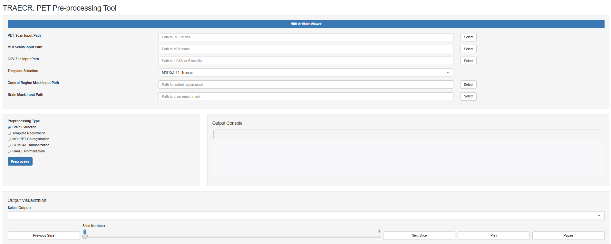
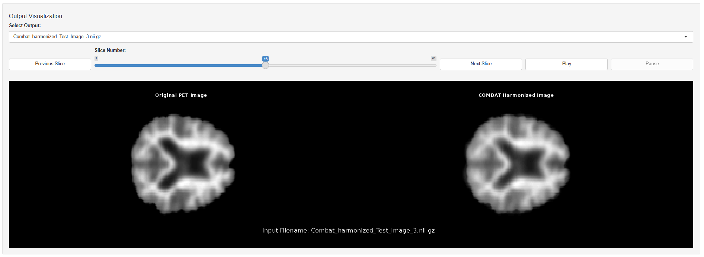

# PET Pre-processing Tool

A Shiny R application for automated preprocessing of neuroimaging data. This tool supports PET and MRI scans, streamlining brain extraction, MNI template registration, MRI-PET co-registration, COMBAT harmonization, and RAVEL normalization.

## Features

- **A Shiny R Application**: A neuroimaging preprocessing tool with interactive visualization, artifact inspection, and error-handling for clear user guidance.
  
  
- **Artifact Viewer**: Launch an external NIfTI artifact viewer to provide a detailed examination of imaging data, aiding in the inclusion or exclusion of neuroimaging data for preprocessing.
  
- **Interactive Visualization**: Inspect preprocessing results with slice-by-slice navigation and real-time updates.
- **Brain Extraction**: Automated skull-stripping of MRI scans to isolate brain tissue.
  
- **MNI Template Registration**: Align MRI scans to the MNI standard space for consistent spatial analysis.
  
- **MRI-PET Co-registration**: Aligns PET scans with corresponding MRI scans for integrated analysis.
  
- **COMBAT Harmonization**: Reduces scanner and site effects in neuroimaging data using the Combating Batch Effects (COMBAT) algorithm.
  
- **RAVEL Normalization**: Normalizes PET scan intensities to reduce unwanted variations using the Removing inter-subject technical variability in magnetic resonance imaging studies (RAVEL) algorithm.
  


- ## Folder Structure

- `templates/`: Contains MNI template files for registration.
- `Dashboard/`: Contains a python code to display and export NIfTI image properties.
- `Output_Brain_Extraction/`: Outputs from the brain extraction step.
- `Output_MNI_Template_Registration/`: Outputs from the MNI registration step.
- `Output_MRI_PET_Co-Registration/`: Outputs from the MRI-PET co-registration step.
- `Output_COMBAT_Harmonization/`: Outputs from COMBAT harmonization.
- `Output_RAVEL_Normalization/`: Outputs from RAVEL normalization.

## Dependencies

### R Packages
- **Data Processing**: `neurobase`, `oro.nifti`, `extrantsr`, `neuroCombat`, `RAVEL`, `ANTsR`
- **Visualization**: `shiny`, `grid`, `rgl`, `png`
- **Utilities**: `fslr`, `shinyFiles`, `reticulate`, `readxl`

### External Tools
- **FSL**: Required for image registration using tools like FLIRT.
- **ANTs**: Used for advanced normalization techniques.
- **Python 3**: For the NIfTI artifact viewer and Python-based integrations.
- **WSL Ubuntu-20.04**:  Required for running the tool on Windows systems.
- **CMake**: Necessary for building and managing dependencies during tool setup.

## Installation

1. **Clone the repository**:
   ```bash
   git clone https://github.com/aambekar-brown/PET-Pre-processing-Tool.git
   ```
2. **Set-up a WSL environment**
   - Follow the instructions in 'Set-up the WSL Environment.txt' to set up a WSL environment with the required packages.
   - Launch the WSL environment:
     ```bash
     wsl -d Ubuntu-20.04 --user <USERNAME>
     ```
3. **Alternatively, download an existing WSL state** with all required packages and software suites.
   - Download WSL state as a .tar file from here: https://drive.google.com/file/d/1vQvLXPSX5VNUDhR811YKWhJwWW6bG6C4/view?usp=sharing
   - Import WSL state as follows:
     ```bash
     wsl --import <CustomWSLName> <InstallLocation> <FileName>
     ```
   - Launch the WSL environment:
     ```bash
     wsl -d <CustomWSLName>  --user pettooluser
     ```
4. **Start the application**:
   ```bash
   Rscript PET_Pre-Processing_Tool.R
   ```
5. **Access the Application**: Open the displayed URL in your preferred web browser.

## Citations:
- Jenkinson M, Beckmann CF, Behrens TE, Woolrich MW, Smith SM (2012). “FSL.” Neuroimage, 62(2), 782–790.
- Fortin JP, Sweeney EM, Muschelli J, Crainiceanu CM, Shinohara RT; Alzheimer's Disease Neuroimaging Initiative. Removing inter-subject technical variability in magnetic resonance imaging studies. Neuroimage. 2016 May 15;132:198-212. doi: 10.1016/j.neuroimage.2016.02.036. Epub 2016 Feb 23. PMID: 26923370; PMCID: PMC5540379.
- Jean-Philippe Fortin, Nicholas Cullen, Yvette I. Sheline, Warren D. Taylor, Irem Aselcioglu, Philip A. Cook, Phil Adams, Crystal Cooper, Maurizio Fava, Patrick J. McGrath, Melvin McInnis, Mary L. Phillips, Madhukar H. Trivedi, Myrna M. Weissman, Russell T. Shinohara. Harmonization of cortical thickness measurements across scanners and sites. NeuroImage, 167, 104-120, 2018
- Avants BB, Tustison NJ, Song G, Cook PA, Klein A, Gee JC. A reproducible evaluation of ANTs similarity metric performance in brain image registration. Neuroimage. 2011 Feb 1;54(3):2033-44. doi: 10.1016/j.neuroimage.2010.09.025. Epub 2010 Sep 17. PMID: 20851191; PMCID: PMC3065962.
- Muschelli, J., Sweeney, E. M., Lindquist, M. A., & Crainiceanu, C. M. (2015). fslr: Connecting the FSL Software with R. The R Journal, 7(1), 163-175.
- Muschelli, J. (2019). neurobase: Basic Functions for Neuroimaging Data. R package version 1.28.0.
- Muschelli, J. (2019). extrantsr: Extra ANTsR Functions. R package version 3.6.0.


